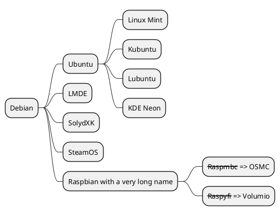

# docsify扩展

## 1. 字数统计
```html
<!--字数插件-->
<script src="https://cdn.jsdelivr.net/npm/docsify-count@latest/dist/countable.min.js"></script>

count:{
		countable:true,
		fontsize:'0.9em',
		color:'rgb(90,90,90)',
		language:'chinese'
	},
```

## 2. tabs选项卡
```html
<!--tab选项卡-->
<script src="https://cdn.jsdelivr.net/npm/docsify-tabs@1"></script>

tabs:{
		persist:true,
		sync:true,
		theme:'classic',
		tabComments:true,
		tabHeadings:true
}
```
**示例**
<!-- tabs:start -->
#  **行测**
80
# **申论**
75
# **计算机**
85
<!-- tabs:end -->

## 3. alerts提示文字
```html
<!--alerts提示文字-->
<script src="https://unpkg.com/docsify-plugin-flexible-alerts"></script>

 'flexible-alerts':{
    style:'callout'
  }
```
**示例**
> [!TIP]
> 语文

> [!NOTE]
> 数学

> [!WARNING]
> 英语

> [!ATTENTION]
> 计算机

## 4. 最新更新记录
```html
<!--最近更新记录-->
<script src="https://cdn.jsdelivr.net/npm/docsify-updated/src/time-updater.min.js"></script>

timeUpdater:{
    text:"<div align='right' width='100%' style='color:grey;font-size:16px;margin-top:10px;'>最后更新时间：{docsify-updated}</div>",
    formatUpdated:"{YYYY}-{MM}-{DD} {HH}:{mm}",
  }
```

## 5. 进度条美化
```html
<!--进度条美化-->
<script src="https://cdn.jsdelivr.net/npm/docsify-progress@latest/dist/progress.min.js"></script>
progress:{
    position:"top",
    color:"var(--theme-color,#42b983)",
    height:"3px",
  }
```

## 6. 回到顶部
```html
<!--回到顶部-->
<script src="https://cdn.jsdelivr.net/gh/Sumsung524/docsify-backTop/dist/docsify-backTop.min.js"></script>
docsifyBackTop:{
    size:32, //数值，组件大小，默认值32.
    bottom:15, //数值，组件底部偏移距离，默认值15.
    right:15, //数值，组件右侧偏移距离，默认值15.
    logo:'top', //logo：字符串或svg矢量图代码，默认为svg代码图标。
    bgColor:'#42b983'
}
```

## 7. 集成plantuml
```html
<!--集成plantuml-->
<script src="//unpkg.com/docsify-pantuml/dist/docsify-plantuml.min.js"></script>

plantuml:{
    skin:'default'
}
```

## 8. 集成docsify-pugin-toc插件
```html
显示文章右侧目录
<link rel="stylesheet" href="https://unpkg.com/docsify-plugin-toc@1.3.1/dist/light.css">
<script src="https://unpkg.com/docsify-plugin-toc@1.3.1/dist/docsify-plugin-toc.min.js"></script>
js配置：
toc:{
    tocMaxLevel:5,
    target:'h2,h3,h4,h5,h6',
    ignoreHeaders:['<!-- {docsify-ignore} -->', '<!-- {docsify-ignore-all} -->']
}
```

## 9. 集成docsify-demo插件（html preview)
html预览，可查看源码
```html
<!--html preview demo-->
<link rel="stylesheet" href="//cdn.jsdelivr.net/npm/docsify-demo@latest/dist/index.min.css"/>
<script src="//cdn.jsdelivr.net/npm/docsify-demo@latest/dist/index.min.js"></script>

```
## 10. 内嵌PDF
```html
<!-- docsify pdf embed -->
<script src="//gcore.jsdelivr.net/npm/pdfobject@2.2.8/pdfobject.min.js"></script>
<script src="//gcore.jsdelivr.net/npm/docsify-pdf-embed-plugin/src/docsify-pdf-embed.js"></script>

markdown: {
        renderer: {
          code: function (code, lang) {
            if (lang === 'drawio') {
              if (window.drawioConverter) {
                console.log('drawio 转化中')
                return window.drawioConverter(code)
              } else {
                return `<div class='drawio-code'>${code}</div>`
              }
            } else if(lang === 'pdf'){
              var pdf_renderer = function(code, lang, verify) {
                  function unique_id_generator(){
                      function rand_gen(){
                          return Math.floor((Math.random()+1) * 65536).toString(16).substring(1);
                      }
                      return rand_gen() + rand_gen() + '-' + rand_gen() + '-' + rand_gen() + '-' + rand_gen() + '-' + rand_gen() + rand_gen() + rand_gen();
                  }
                  if(lang && !lang.localeCompare('pdf', 'en', {sensitivity: 'base'})){
                      if(verify){
                          return true;
                      }else{
                          var divId = "markdown_code_pdf_container_" + unique_id_generator().toString();
                          var container_list = new Array();
                          if(localStorage.getItem('pdf_container_list')){
                              container_list = JSON.parse(localStorage.getItem('pdf_container_list'));	
                          }
                          container_list.push({"pdf_location": code, "div_id": divId});
                          localStorage.setItem('pdf_container_list', JSON.stringify(container_list));
                          return (
                              '<div style="margin-top:'+ PDF_MARGIN_TOP +'; margin-bottom:'+ PDF_MARGIN_BOTTOM +';" id="'+ divId +'">'
                                  + '<a href="'+ code + '"> Link </a> to ' + code +
                              '</div>'
                          );
                      } 
                  }
                  return false;
              }
              if(pdf_renderer(code, lang, true)){
                return pdf_renderer(code, lang, false);
              }
            } 
            else {
              return this.origin.code.apply(this, arguments);
            }
          }
        }
      }
```

## 11. 问答法
```html
 <!-- docsify-accordion -->
  <link rel="stylesheet" href="//gcore.jsdelivr.net/npm/docsify-accordion/src/style.css">
  <script src="//gcore.jsdelivr.net/npm/docsify-accordion/src/index.js"></script>

   'flexible-alerts': {
        style: 'callout'
      },
```
+ 问题1? +

  答案1

+ 问题2? +

  答案2


## 12. 嵌入 iframe 示例
```html
[docsify](https://8qrvbq.csb.app/# ':include :type=iframe id=a1 width=100% height=400px')
```
[docsify](https://8qrvbq.csb.app/# ':include :type=iframe id=a1 width=100% height=400px')

## 13. 嵌入 drawio 示例
```html
[filename](https://cdn.jsdelivr.net/npm/docsify-drawio/test.drawio ':include :type=code')
```
[filename](https://cdn.jsdelivr.net/npm/docsify-drawio/test.drawio ':include :type=code')
